<div align="center">

# Planar Monocular SLAM Project

Leonardo Pitotti - 2000797


**Probabilistic Robotics 2025/26** - Supervisors: *Prof. G. Grisetti, PhDs L. De Rebotti, D. Ceriola*


</div>

## Description
Simultaneous Localization and Mapping of a differential-drive robot with a monocular camera that moves on a plane. Intrinsic parameters of the camera $`\mathbf{K}`$ are known, as well as its fixed pose $`\mathbf{T}_{cam}`$ w.r.t. the robot base.

 The robot records: **wheel odometry** and **landmark projections** (for every frame, the pixel coordinates of the landmarks in view, with known data association).


The goal is to estimate both the **robot trajectory** and the **3D positions of the landmarks**, then compare them against the ground truth.
Three triangulation strategies are compared for the initial guess, which is then refined by a Total Least Squares Bundle Adjustment on $`SE(2) \times \mathbb{R}^3`$.

The whole project is written in **Octave**.

## Dataset

| File | Description | Row Format |
|------|-------------|------------|
| `camera.dat` | Camera intrinsics `K`, camera pose w.r.t. robot `cam_transform`, depth range `z_near`/`z_far`, image `width`/`height` | - |
| `trajectory.dat` | Odometry and ground-truth pose for every frame | `POSE_ID` `odom_x` `odom_y` `odom_θ` `gt_x` `gt_y` `gt_θ` |
| `meas-XXXXX.dat` | One file per frame: sequence number, GT pose, odometry pose and the list of observed points | `point` `LOCAL_ID` `LANDMARK_ID` `col` `row` |
| `world.dat` | Ground-truth landmark positions, **used only for evaluation** | `LANDMARK_ID` `x` `y` `z` |

<div align="center">

| Frames | GT Landmarks | Image | $`f_x = f_y`$ | $`(c_x, c_y)`$ | Depth range | Camera offset |
|:---:|:---:|:---:|:---:|:---:|:---:|:---:|
| 200 | 1000 | 640 × 480 | 180 px | (320, 240) | [0, 5] m | 0.2 m ahead of the base, optical axis along robot $`x`$ |

</div>


## Data Loading [`data_read/`](data_read/)

| File | Loader | Output |
|------|--------|--------|
| `camera.dat` | [`read_camera_data`](data_read/read_camera_data.m) | struct with `K`, `T`, `z_near`, `z_far`, `width`, `height` |
| `trajectory.dat` | [`read_traj_data`](data_read/read_traj_data.m) | struct with `id`, `odom` (N×3), `gt` (N×3) |
| `meas-*.dat` | [`read_meas_data`](data_read/read_meas_data.m) | `containers.Map`: landmark ID → `{count, observations}` |
| `world.dat` | [`read_world_data`](data_read/read_world_data.m) | `containers.Map`: landmark ID → `[x; y; z]` |

Measurements are grouped **by landmark** rather than by frame: each entry of the database is the *track* of one landmark, i.e. the list of all frames in which it was observed, together with the pixel coordinates and the odometry pose of that frame. This is a good layout for multi-view triangulation.

<div align="center">

| Landmark tracks | Total observations | Avg Obs / landmark |  Max Obs / landmark |
|:---:|:---:|:---:|:---:|
| 888 | 19,631 | 22.11 | 71 |

</div>

Of the 888 observed landmarks, **838** are seen in at least two frames and can be triangulated. The remaining 112 of the 1000 GT landmarks are never observed.

## Initial Guess

Bundle Adjustment is a local method, so it needs a reasonable initial guess.

- **Poses**: initialized directly from odometry, $`\mathbf{X}_{R_i} = \text{v2t}(\text{odom}_i)`$.
- **Landmarks**: triangulated from their tracks using the odometry poses. Only landmarks seen in **at least 2 frames** are triangulated; the others are dropped from the problem.

Three triangulation strategies were implemented and compared. All of them are based on the camera pose in world frame for every observation:

```math
\mathbf{T}^{w}_{c,i} = \text{v2t}(\text{odom}_i)\,\mathbf{T}_{cam},
\qquad
\mathbf{P}_i = \mathbf{K}\,\big[(\mathbf{T}^{w}_{c,i})^{-1}\big]_{3\times 4}
```

### Method 1: Consecutive-pairs DLT [`triangulate1.m`](triangulate1.m)

For each landmark, every pair of **consecutive** observations $`(k, k+1)`$ is triangulated with the Direct Linear Transform. Imposing $`\mathbf{u} \times \mathbf{P}\tilde{\mathbf{p}} = \mathbf{0}`$ for both views gives the homogeneous system $`\mathbf{A}\tilde{\mathbf{p}} = \mathbf{0}`$:

```math
\mathbf{A} = \begin{bmatrix}
u_1\,\mathbf{p}_{1,3}^T - \mathbf{p}_{1,1}^T \\
v_1\,\mathbf{p}_{1,3}^T - \mathbf{p}_{1,2}^T \\
u_2\,\mathbf{p}_{2,3}^T - \mathbf{p}_{2,1}^T \\
v_2\,\mathbf{p}_{2,3}^T - \mathbf{p}_{2,2}^T
\end{bmatrix}
```

where $`\mathbf{p}_{i,j}^T`$ is the $`j`$-th row of $`\mathbf{P}_i`$. The solution is the right singular vector of the smallest singular value, $`\tilde{\mathbf{p}} = \mathbf{V}_{(:,4)}`$, then dehomogenized.

Each pair estimate is **rejected** if:
- its depth in either camera is outside $`[z_{near}, z_{far})`$ (the depth is computed on the dehomogenized point, so the arbitrary sign of the SVD null vector does not matter);
- it lies more than 50 m from the world origin in the $`xy`$ plane (nearly parallel rays).

The surviving pair estimates are **averaged** to get the landmark position.

Consecutive frames are close together, so the baseline is small and each pair is poorly conditioned; averaging many noisy estimates only partially fixes this.

### Method 2: All-pairs DLT [`triangulate2.m`](triangulate2.m)

Same DLT solver and the same filters as Method 1, but **every** pair $`(a, b),\ a < b`$ of observations of a landmark is triangulated, instead of only consecutive ones. The idea was to bring in large-baseline pairs, which are much better conditioned and dominate the average. Projection matrices are cached once per observation, since each one is reused in $`O(n)`$ pairs.

The cost is $`O(n^2)`$ triangulations per landmark instead of $`O(n)`$.

### Method 3: Least-squares ray intersection [`triangulate3.m`](triangulate3.m)

Every observation defines a ray from the camera center $`\mathbf{o}_i`$ with unit direction

```math
\mathbf{d}_i = \mathbf{R}^{w}_{c,i}\,\frac{\mathbf{K}^{-1}[u_i,\ v_i,\ 1]^T}{\lVert \mathbf{K}^{-1}[u_i,\ v_i,\ 1]^T \rVert}
```

The landmark is the point $`\mathbf{p}`$ that minimizes the sum of squared perpendicular distances from **all** rays at once.

A single $`3 \times 3`$ linear system per landmark has to be solved. It is Euclidean from the start (no dehomogenization, no sign ambiguity) and uses all observations jointly in $`O(n)`$. The only filter is the 50 m $`xy`$ rejection for degenerate (nearly parallel) ray bundles.

### Initial-guess comparison

<div align="center">

| | Method 1 (consecutive DLT) | Method 2 (all-pairs DLT) | Method 3 (ray intersection) |
|:---|:---:|:---:|:---:|
| Landmarks estimated | 793 / 888 (89.3%) | 793 / 888 (89.3%) | **837 / 888 (94.3%)** |
| Landmark RMSE (initial) | **1.415 m** | 1.637 m | 4.030 m |
| Landmark median error (initial) | **0.985 m** | 1.035 m | 1.394 m |
| Max error (initial) | **7.59 m** | **7.59 m** | 38.21 m |
| Triangulation time | 11.7 s | 41.8 s | **4.0 s** |

</div>

Method 2 is the slowest because it solves $`O(n^2)`$ pairs per landmark. Method 3 is the fastest because it solves a single $`3\times3`$ system per landmark.

| Method 1 | Method 2 | Method 3 |
|:---:|:---:|:---:|
| 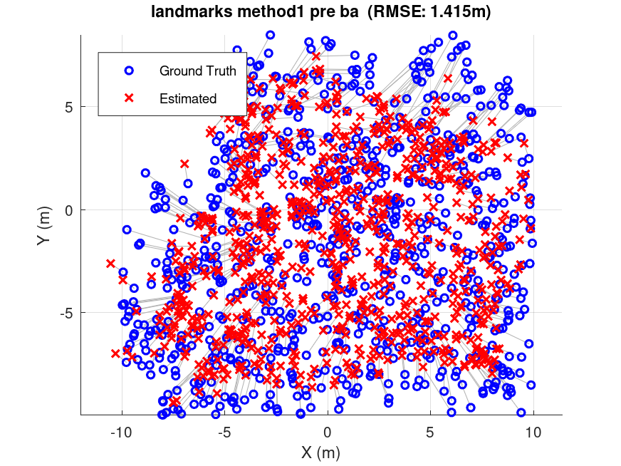 | 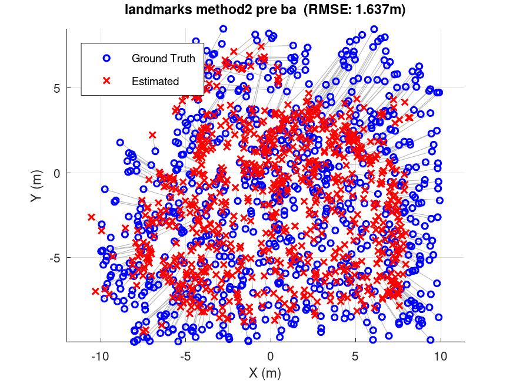 | 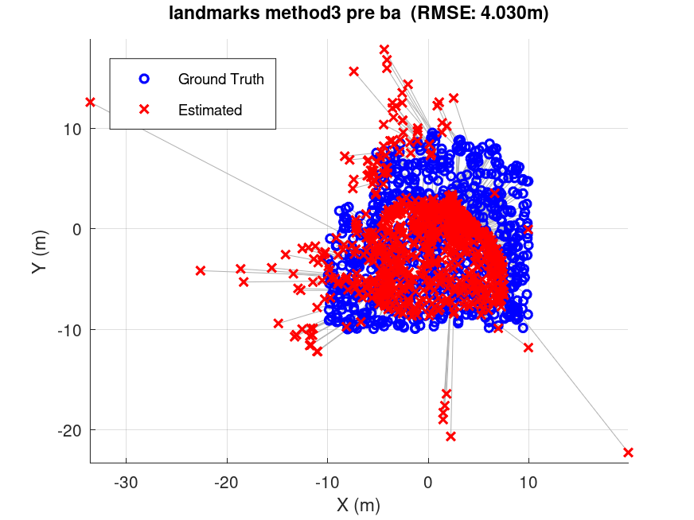 |

## Bundle Adjustment  [`bundle_adjustment.m`](bundle_adjustment.m)

Poses and landmarks are refined jointly with an iterative Total Least Squares (Gauss-Newton with constant damping) solver, adapted from the one seen in class.

### Qualifying the Domain

#### State

- **Robot poses** $`\mathbf{X}_R \in SE(2)^N`$, $`N = 200`$. They are stored as $`4\times4`$ homogeneous matrices, but only 3 DoF ($`x, y, \theta`$) are optimized, since the robot stays on the plane by construction.
- **Landmarks** $`\mathbf{X}_L \in \mathbb{R}^{3\times M}`$, where $`M`$ is the number of triangulated landmarks.

The perturbation vector is $`\Delta\mathbf{x} \in \mathbb{R}^{3N + 3M}`$, with all poses first and then all landmarks ([`poseMatrixIndex`](BundleAdjustment/poseMatrixIndex.m), [`landmarkMatrixIndex`](BundleAdjustment/landmarkMatrixIndex.m)).

#### Measurements

Two types of factors are used:
- **Pose-pose** (odometry): $`\mathbf{Z}_{i,i+1} = \text{odom}_i^{-1}\,\text{odom}_{i+1}`$, one per consecutive pair of frames.
- **Pose-landmark** (projection): the measured pixel $`\mathbf{z}_{ij}`$ of landmark $`j`$ in frame $`i`$.

[`prepare_solver_data.m`](BundleAdjustment/prepare_solver_data.m) turns the triangulated map and the measurements database into these dense arrays and maps dataset landmark IDs to contiguous state indices.

### Box-plus operator [`boxPlus.m`](BundleAdjustment/boxPlus.m)

```math
\mathbf{X}_{R_i} \leftarrow \mathbf{X}_{R_i}\cdot \text{v2t}(\Delta\mathbf{x}_{R_i}),
\qquad
\mathbf{X}_{L_j} \leftarrow \mathbf{X}_{L_j} + \Delta\mathbf{x}_{L_j}
```

The pose perturbation is applied on the **right**, i.e. it is expressed in the robot's local frame. The Jacobians in the code are derived for this convention.

### Pose-pose factor [`poseErrorAndJacobian.m`](BundleAdjustment/poseErrorAndJacobian.m)

**Error.** The prediction is $`\hat{\mathbf{Z}} = \mathbf{X}_i^{-1}\mathbf{X}_j`$. The error compares the **planar** part of prediction and measurement element-wise (chordal distance), without needing a $`\boxminus`$ operator:

```math
\mathbf{e}_{ij} = \text{flat}(\hat{\mathbf{Z}}) - \text{flat}(\mathbf{Z}) \in \mathbb{R}^6,
\qquad
\text{flat}(\mathbf{M}) = [\,m_{11},\ m_{21},\ m_{12},\ m_{22},\ m_{14},\ m_{24}\,]^T
```

Only the $`2\times2`$ rotation block and the $`xy`$ translation are used; the remaining entries of an $`SE(2)`$ matrix embedded in $`4\times4`$ are constant and would only add zero rows.


### Pose-landmark factor [`projectionErrorAndJacobian.m`](BundleAdjustment/projectionErrorAndJacobian.m)

**Error.** The landmark is moved into the robot frame, then into the camera frame, and projected:

```math
\mathbf{p}_r = \mathbf{X}_R^{-1}\,\mathbf{X}_L,
\qquad
\mathbf{p}_c = \mathbf{T}_{cam}^{-1}\,\mathbf{p}_r,
\qquad
\mathbf{h} = \mathbf{K}\,\mathbf{p}_c,
\qquad
\hat{\mathbf{z}} = \begin{bmatrix} h_x / h_z \\ h_y / h_z \end{bmatrix},
\qquad
\mathbf{e} = \hat{\mathbf{z}} - \mathbf{z}
```

A measurement is **skipped** for the current iteration if the landmark is behind the camera ($`p_{c,z} < 0`$) or if $`\hat{\mathbf{z}}`$ falls outside the $`640\times480`$ image.


### Solver details

At every iteration the two linearizers ([`linearizeProjections`](BundleAdjustment/linearizeProjections.m), [`linearizePoses`](BundleAdjustment/linearizePoses.m)) accumulate $`\mathbf{H} = \sum \mathbf{J}^T\mathbf{J}`$ and $`\mathbf{b} = \sum \mathbf{J}^T\mathbf{e}`$, and the update is

```math
\Delta\mathbf{x} = -(\mathbf{H} + \lambda\mathbf{I})^{-1}\,\mathbf{b},
\qquad
\mathbf{x} \leftarrow \mathbf{x} \boxplus \Delta\mathbf{x}
```

- **Robust kernel.** For each factor with $`\chi^2 = \mathbf{e}^T\mathbf{e}`$ above a threshold $`\tau`$, the error is rescaled by $`\sqrt{\tau/\chi^2}`$, which caps its contribution at $`\tau`$. Separate thresholds are used for projections and odometry.
- **Odometry weighting.** The projection $`\chi^2`$ (pixels²) is orders of magnitude larger than the odometry one (unit-less matrix entries). Without rebalancing, odometry has no effect on the solution, so the odometry factors are multiplied by an information weight $`\omega`$ (their Jacobians and errors are scaled by $`\sqrt{\omega}`$). The reported $`\chi^2`$ is the unweighted one.
- **Damping.** A constant $`\lambda\mathbf{I}`$ regularizes landmark blocks that are close to rank-deficient (short baselines).
- **Gauge fixing.** The problem is defined up to a rigid planar motion, so the first pose is anchored: its rows/columns of $`\mathbf{H}`$ are replaced by the identity and its entries of $`\mathbf{b}`$ are zeroed.
- **Stopping rule.** `num_iterations` is only an upper bound. The loop stops at iteration $`k`$ as soon as $`|\chi^2_{k-1} - \chi^2_k| < \varepsilon\,\chi^2_{k-1}`$. At that point the previous update no longer changes the cost, so the current state is returned as the solution.

<div align="center">

| Parameter | Value | Meaning |
|:---|:---:|:---|
| `num_iterations` | 50 | Maximum number of BA iterations |
| `convergence_tol` | 1e-5 | Relative χ² change $`\varepsilon`$ below which BA stops |
| `kernel_threshold_proj` | 1000 px² | Robust-kernel threshold for projection factors |
| `kernel_threshold_pose` | 1.0 | Robust-kernel threshold for odometry factors |
| `pose_weight` | 1000 | Information weight $`\omega`$ of odometry vs projections |
| `damping` | 0.01 | Constant diagonal damping $`\lambda`$ |

</div>

#### Sparsity of H

| Method 1 | Method 2 | Method 3 |
|:---:|:---:|:---:|
| 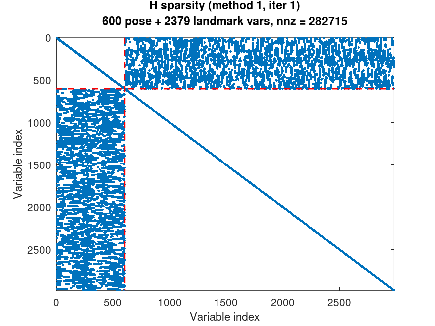 |  |  |

The dashed lines separate the pose variables (top-left) from the landmark variables (bottom-right). The **block structure** is the same for all methods:
- **Pose block:** block-tridiagonal, from the odometry chain.
- **Landmark block:** block-diagonal, because landmarks are never directly connected.
- **Off-diagonal blocks:** pose-landmark coupling, with a nonzero block only where landmark $`j`$ is observed in frame $`i`$.

The **exact entries at iteration 1 differ**, because a projection that falls behind the camera or outside the image with the initial guess is skipped.


## Evaluation

- **Trajectory**  [`evaluate_traj.m`](evaluate_traj.m): for every consecutive pair of poses it computes the relative pose error, and reports the RMSE of its translation and rotation over all pairs..
- **Map**  [`evaluate_map.m`](evaluate_map.m): the Euclidean error between each estimated landmark and its ground-truth position in `world.dat`. Besides the **RMSE**, it reports the **median**, the **max** and the **number of landmarks with error > 0.5 m**. 
- **Error vs. observations**  [`draw_error_vs_obs.m`](draw_error_vs_obs.m): per-landmark error after BA against the number of frames in which the landmark was observed. It shows *which* landmarks fail.
- **Timings**: `main.m` times triangulation and BA with `tic`/`toc`, and prints them together with all the map metrics in a final summary table. 

## Results

All three pipelines share the same initial trajectory (odometry) and the same BA parameters. They differ only in the landmark initial guess.

<p align="center">
  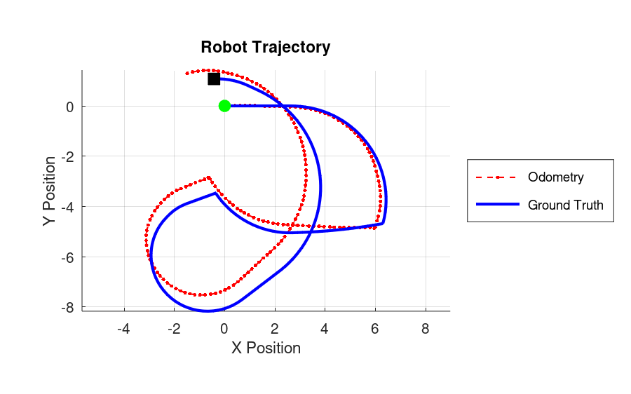<br>
  <i>Odometry vs ground truth trajectories.</i>
</p>

### Method 1: Consecutive-pairs DLT

| Before BA | After BA |
|:---:|:---:|
|  | 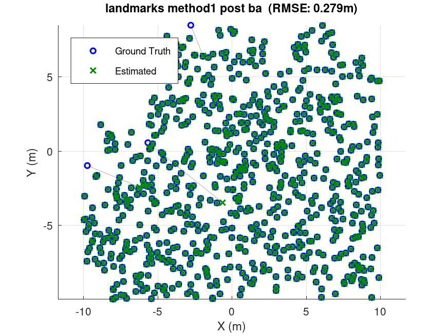 |

<div align="center">

| Metric | Initial | After BA | Improvement |
|:---|:---:|:---:|:---:|
| Landmark RMSE | 1.415 m | 0.279 m | 80.3% |
| Landmark median error | 0.985 m | 0.0066 m | 99.3% |
| Landmarks with error > 0.5 m | 715 / 793 | 3 / 793 | - |
| Trajectory translation RMSE (relative) | 0.015390 m | 0.000201 m | 98.7% |
| Trajectory rotation RMSE (relative) | 0.015657 rad | 0.000018 rad | 99.9% |

</div>

<p align="center">BA converged in <b>19 iterations</b> (103 s).</p>

<p align="center">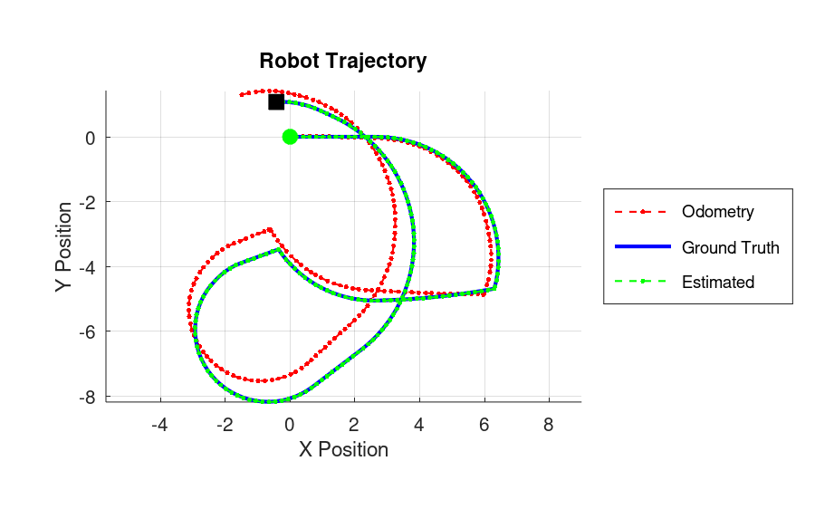</p>

### Method 2: All-pairs DLT

| Before BA | After BA |
|:---:|:---:|
|  | 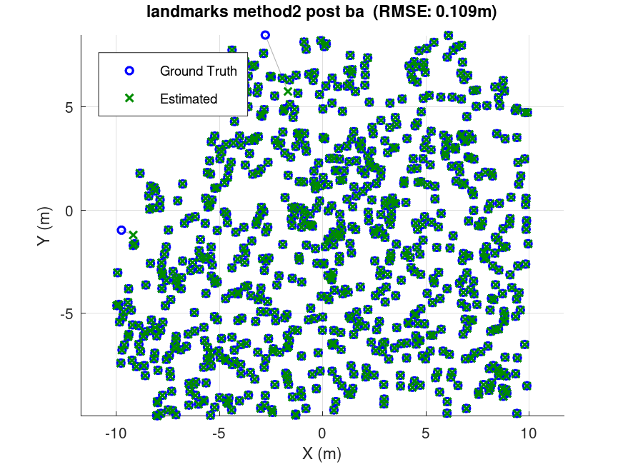 |

<div align="center">

| Metric | Initial | After BA | Improvement |
|:---|:---:|:---:|:---:|
| Landmark RMSE | 1.637 m | **0.109 m** | **93.3%** |
| Landmark median error | 1.035 m | **0.0065 m** | 99.4% |
| Landmarks with error > 0.5 m | 764 / 793 | **2 / 793** | - |
| Trajectory translation RMSE (relative) | 0.015390 m | **0.000198 m** | 98.7% |
| Trajectory rotation RMSE (relative) | 0.015657 rad | **0.000018 rad** | 99.9% |

</div>

<p align="center">BA converged in <b>20 iterations</b> (116 s).</p>

<p align="center"></p>

### Method 3: Ray intersection

| Before BA | After BA |
|:---:|:---:|
|  | 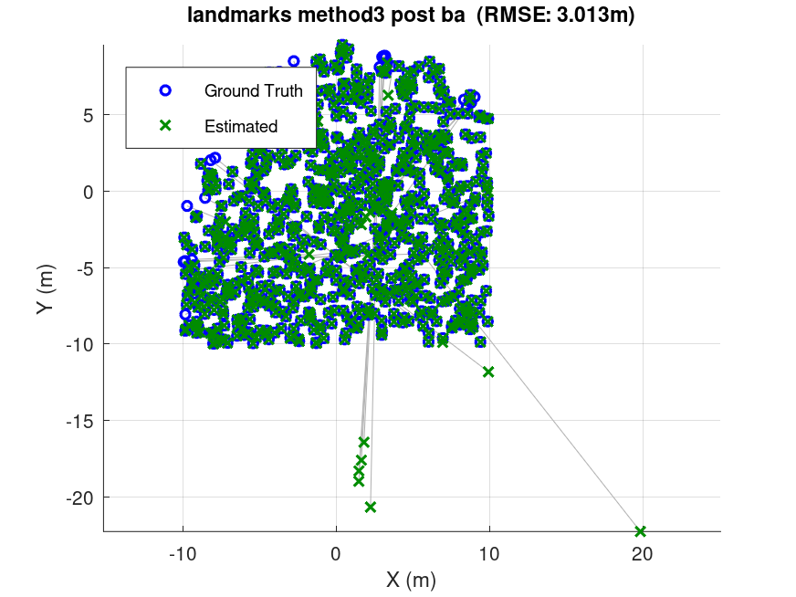 |

<div align="center">

| Metric | Initial | After BA | Improvement |
|:---|:---:|:---:|:---:|
| Landmark RMSE | 4.030 m | 3.013 m | 25.2% |
| Landmark median error | 1.394 m | 0.0067 m | 99.5% |
| Landmarks with error > 0.5 m | 808 / 837 | 21 / 837 | - |
| Trajectory translation RMSE (relative) | 0.015390 m | 0.000198 m | 98.7% |
| Trajectory rotation RMSE (relative) | 0.015657 rad | 0.000018 rad | 99.9% |

</div>

<p align="center">BA converged in <b>42 iterations</b> (254 s).</p>

<p align="center"></p>

Method 3 needs about twice as many iterations as the DLT methods, but it ends with the **same trajectory accuracy and the same median landmark error as Method 2**. Its RMSE stays high because of **21 landmarks** that BA never moves. Their max error is 38.21 m both before and after BA. Ray intersection has no depth check: when the rays of a landmark are nearly parallel, the least-squares intersection can land far away or behind the cameras, and only the loose 50 m filter is there to catch it. A landmark whose predicted projections are all behind the camera or outside the image contributes no factor to $`\mathbf{H}`$. BA gets no gradient for such a landmark, and its error is not counted in χ², which is why Method 3's final χ² is as low as Method 2's even though its map is worse.

### Convergence

<div align="center">
  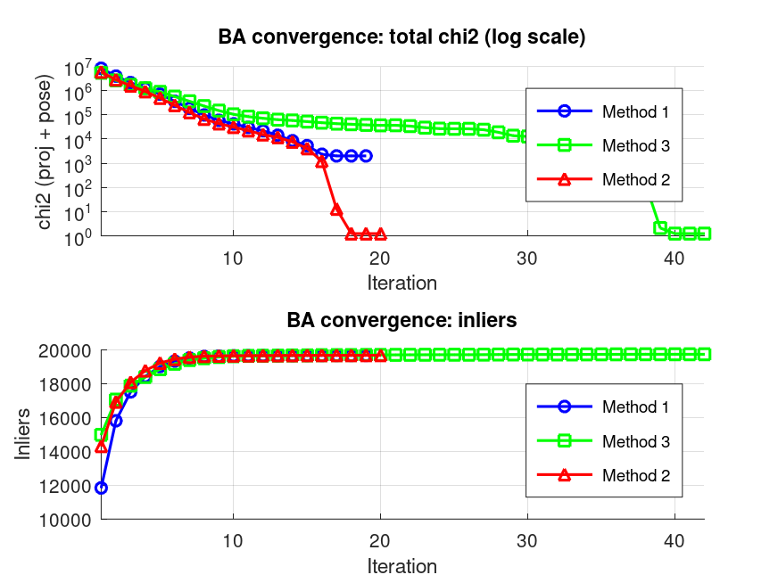<br>
  <i>Total χ² (log scale) and number of inliers per iteration. Each curve ends where the stopping rule is satisfied.</i>
</div>


- **Method 1** plateaus around iteration 15 and stops at iteration 19. 
- **Method 2** stops at iteration 20.
- **Method 3** decreases slowly between iterations 10 and 37, while its few far-off landmarks are dragged back, and then drops. In this case having the stopping rule is useful, otherwise we may stop without convergence.

### Error vs. number of observations

<div align="center">
  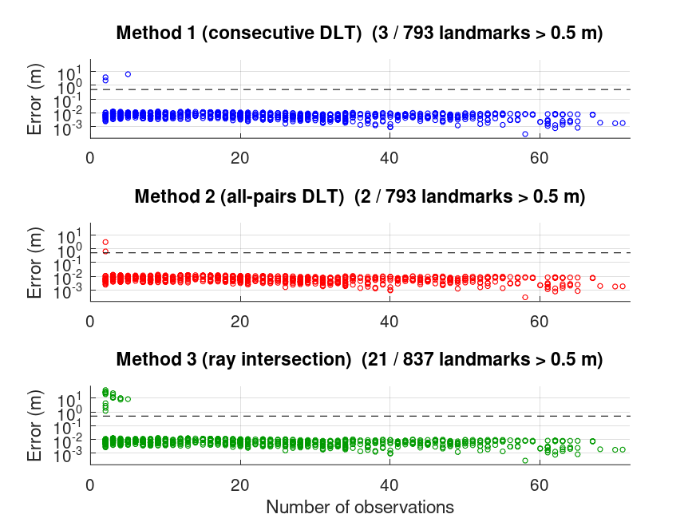<br>
  <i>Per-landmark error after BA (log scale) vs. number of observations.</i>
</div>

In all three methods, the landmarks form a tight band between roughly 1 mm and 2 cm, regardless of how often they are seen. **Every landmark above 0.5 m has at most 5 observations**, and most of them have only 2. With so few views, the baseline is short, the triangulation is poorly conditioned, and a single bad initial position is enough to leave the landmark in a wrong basin, or with no valid projection at all. 

## Comparison

<div align="center">

| Metric | Method 1 <br> consecutive DLT | Method 2 <br> all-pairs DLT | Method 3 <br> ray intersection |
|:---|:---:|:---:|:---:|
| Landmarks estimated | 793 (89.3%) | 793 (89.3%) | **837 (94.3%)** |
| Landmark RMSE - initial | **1.415 m** | 1.637 m | 4.030 m |
| Landmark RMSE - after BA | 0.279 m | **0.109 m** | 3.013 m |
| Landmark median - after BA | 0.0066 m | 0.0065 m | 0.0067 m |
| Landmarks > 0.5 m - after BA | 3 | **2** | 21 |
| Translation RMSE - after BA | 0.000201 m | **0.000198 m** | **0.000198 m** |
| Rotation RMSE - after BA | **0.000018 rad** | **0.000018 rad** | **0.000018 rad** |
| Final χ² | 2001 | **1.09** | **1.09** |
| BA iterations | **19** | 20 | 42 |
| Triangulation time | 11.7 s | 41.8 s | **4.0 s** |
| BA time (per iteration) | **103 s** (5.4 s) | 116 s (5.8 s) | 254 s (6.0 s) |
| **Total time** | **115 s** | 158 s | 258 s |

</div>

## Some Observations

- All three methods give essentially the same result for the well-observed part of the map. The differences in RMSE come from the "weakly observed" landmarks.
- Initial RMSE is not a good predictor of the final result. Method 1 starts with the best RMSE and ends in a worse local minimum than Method 2. Method 3 starts with by far the worst RMSE and still recovers the full trajectory.
- **Method 2 (all-pairs DLT)** is the best pipeline. It has the lowest landmark RMSE (0.109 m), the fewest outliers (2) and a residual χ² of ~1 within 20 iterations. Averaging over all pairs includes the wide-baseline ones, so the estimate is not driven by the poorly conditioned short-baseline pairs that Method 1 relies on exclusively.
